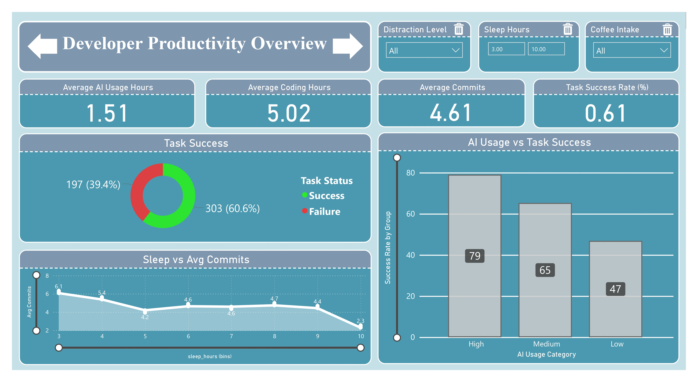

# 🧠 AI Impact Power BI Dashboard

This repository hosts a feature-rich, interactive **Power BI dashboard** that explores the **impact of Artificial Intelligence on Developer Performance and Focus across industries** using a real-world CSV dataset. The dashboard combines modern BI features and intuitive UX design to deliver actionable insights for data-driven decision-making.

---

## 📌 Project Objective

To visualize and analyze the **growing influence of AI technologies** across sectors, highlighting key metrics like cost savings, productivity gains, and AI adoption trends — all through **interactive, drillable, and dynamic Power BI visuals**.

---

## 📁 Repository Contents

| File Name                     | Description |
|------------------------------|-------------|
| `[Ai Impact Dashboard.pbix](https://github.com/mp-patel04/AI-Impact-Dashboard/blob/main/Ai%20Impact%20Dashboard.pbix)`   | Main Power BI report file |
| `ai_impact_dataset.csv`      | Raw dataset used for analysis |
| `Ai Impact Dashboard_page-0001.jpg` - `Ai Impact Dashboard_page-0006.jpg` | Screenshots of key report pages |
| `README.md`                  | Project documentation |

---

## 📊 Key Power BI Features Used

This dashboard leverages **advanced Power BI capabilities** to provide a professional-grade analytical experience:

### 🔷 Visualizations
- Bar & Column Charts (Clustered & Stacked)
- Line & Area Charts
- KPI Cards
- Pie / Donut Charts
- Tables with Conditional Formatting
- **Decomposition Tree**
- **Q&A (Natural Language Query) Visual**
- **Drillthrough Pages**
- **Custom Tooltips**
- **Bookmarks for View Switching**
- **Page Navigation Buttons**

### 🎯 Analytical Features
- Dynamic DAX Measures for KPIs (e.g., YOY %, Growth Rate, AI ROI)
- Time Intelligence Functions
- Data Filtering by Industry, Region, and Year
- Interactive Cross-highlighting between visuals

### 🧭 User Experience (UX) Enhancements
- Multi-page navigation with custom icons
- Tooltip pages for hover details
- Bookmark toggles (e.g., switch between light/dark modes or dashboards/views)
- Clean layout with theme-based visuals and fonts
- Q&A box for natural language querying
- Drillthrough to industry-specific reports

---

## 📈 Sample KPIs Displayed

| KPI Name              | Description                                  |
|-----------------------|----------------------------------------------|
| 💰 Cost Reduction     | AI-driven reduction in operational expenses  |
| ⚡ Efficiency Index   | Productivity improvements due to automation  |
| 📉 Manual Effort Saved| Time saved due to intelligent workflows      |
| 🌐 Industry Coverage  | Number of sectors impacted by AI             |

---

## 📷 Dashboard Preview

> Insert your screenshots below (update filenames accordingly):

### 📍 Overview Page

### 📍 AI Trends by Industry

### 📍 Decomposition Tree Analysis

### 📍 Q&A Page

---

## 🗃️ Dataset Description

The dataset (`ai_impact_dataset.csv`) includes the following attributes:

- `Industry`  
- `Year`  
- `AI Adoption %`  
- `Cost Savings ($)`  
- `Productivity Index`  
- `Employees Impacted`  
- `Region`  
- `AI Investment ($)`  

> *The data was cleaned and transformed within Power BI using Power Query (M Language).*

---

## 🚀 How to Use This Project

1. Clone or download this repository.
2. Open the `Ai Impact Dashboard.pbix` file using **Power BI Desktop**.
3. Explore insights through:
   - Slicers and filters
   - Q&A visual
   - Drillthrough and decomposition trees
   - Navigation buttons and bookmarks

---

## 🔧 Tools & Technologies

- **Power BI Desktop**
- **Power Query Editor (M)**
- **DAX (Data Analysis Expressions)**
- **CSV Dataset (manually cleaned)**
- GitHub for project hosting

---

## 👨‍💻 Author

**Manish Patel**

- 🔗 [GitHub](https://github.com/mp-patel04)
- 📫 *(Add LinkedIn or Email if you'd like)*

---

## ⭐ Feedback & Support

If you find this project helpful or insightful:
- 🌟 Star this repository
- 🔄 Share it with your network
- 💬 Raise issues or suggestions in the Issues tab

---

## 📌 Future Improvements (Planned)

- ✅ Integration with external APIs for real-time data
- ✅ Deploy to Power BI Service for public embedding
- ✅ Add voice-assisted data navigation with Power BI Copilot

---

